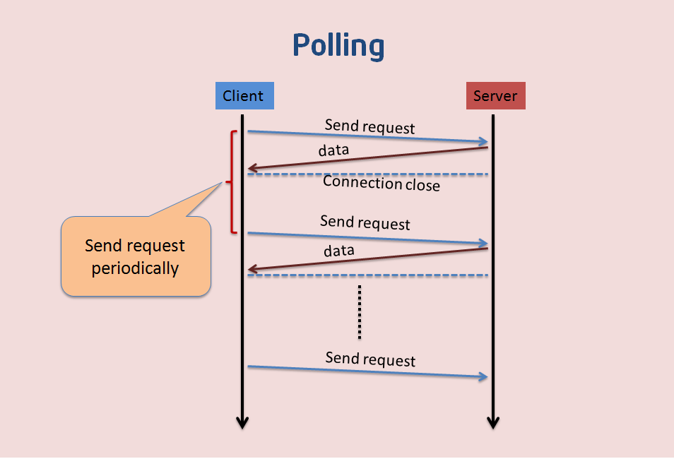

# webstock学习

## 前言

本人平时学习及收集内容，欢迎参入一起讨论。

## 内容

- 什么是WebSocket协议
- 为什么要用WebSocket
- 了解WebSocket
- WebkSocket相关API
- 完整例子

### 一、什么是WebSocket协议

`websocket`是`HTML5`规范中的一部分，它借鉴了`socket`这种思想，为`web`应用程序客户端和服务端之间提供了一种全双工通信机制。同时，它又是一种新的应用层协议，`websocket`协议是为了提供web应用程序和服务端全双工通信而专门制定的一种应用层协议，通常它表示`ws://echo.websocket.org/?encoding=text HTTP/1.1`，可以看到除了前面的协议名和`http`不同之外，它的表示地址就是传统的`url`地址。

### 二、为什么要用WebSocket

- 现有的HTTP的架构模式
- HTTP的特点
- 了解HTTP轮询，长轮询及存在的问题

#### 2.1 现有的HTTP的架构模式

`HTTP`是客户端/服务器模式中请求-响应所用的协议，在这种模式中，客户端(一般是web浏览器)向服务器提交`HTTP`请求，服务器响应请求的资源。

#### 2.2 HTTP的特点

- `HTTP`是半双工协议，也就是说，在同一时刻浏览只能单向流动，客户端向服务器发送请求，然后服务器响应请求。服务器不能主动推送数据给浏览器。当然这个`HTTP2`已经实现。
- 当初这么设计也是有原因的，假如服务器能主动推送数据给浏览器的话，那么浏览器很容易受到攻击，比如一些广告商会主动把一些广告信息强行的传输给客户端。
- 半双工的缺点是：效率非常低。

#### 2.3 了解HTTP轮询，长轮询及存在的问题

1. 一般情况下，浏览器访问网页时，会向页面所在的服务器发送一个HTTP请求，Web服务器确认请求并向浏览器返回响应。但是像股价，实时新闻等到达浏览器
2. 显示页面时已经过时了，如果用户想要得到最新的实时信息，他们就要不断的刷新页面，这种显然是不切实际的。
3. **轮询：** 轮询是通过浏览器定时的向`web`服务器发送`http`的`get`请求，服务器收到请求后，就把最新的数据发回给客户端，客户端得到数据后，将其显示出来，然后再定期的重复这一过程，虽然可以满足需求，但是存在一些缺点，比如某一段时间内`web`服务器没有更新的数据，但是浏览器仍然需要定时的发送Get请求过来询问，那么即浪费了带宽，又浪费了`cpu`的利用率。如图：

4. **长轮询：** 客户端向服务器请求信息，并在设定的时间段内打开一个连接，服务器如果没有任何信息，会保持请求打开，直到有客户端可用的信息，或者直到指定的超时用完为止。这个时候，客户端会重新向服务器请求信息。长轮询也可以叫做`comet`或反向`ajax`。它会延长`HTTP`响应的完成，直到服务器有需要发送给客户端的内容，这种技术通常可以叫“挂起GET”或“搁置POST”
   - 缺点是：当信息量非常大的时候，长轮询相对于`http`轮询并没有明显的性能优势，因为客户端必须频繁地重连到服务器以读取新信息。造成网络的表现和常规轮询相同。


参考资料:[Web端即时通讯技术盘点：短轮询、Comet、Websocket、SSE](Web端即时通讯技术盘点：短轮询、Comet、Websocket、SSE)

### 三、了解WebSocket

WebSocket是一种全双工，双向，单套接字连接，使用WebSocket，HTTP请求变成打开Websocket的链接的单一请求，并且重用从客户端到服务器以及服务到客户的同一连接。

WebSocket减少了延迟，因为一旦建立起WebSocket连接，服务器可以在消息可用时发送他们。和轮询不同的是：WebSocket只发出一个请求，服务器不需要等待来自客户端的请求，且客户端可以在任何时候向服务器端发送消息，和轮询相比的话，不管是否有可用消息，每隔一段时间都发送一个请求，单一请求大大减少了延迟。如图：


#### 3.1 特点

- 握手阶段采用HTTP协议，默认端口是80和443
- 建立在TCP协议基础之上，和HTTP协议属于应用层
- 可以发送文本，也可以发送二进制数据
- 没有同源限制，客户端可以与任意服务器通信
- 协议标识符是ws(如果加密，为wss)，如`ws://localhost:8023`

#### 3.2 优点

- 

#### 3.3 应用场景

聊天，大型多人在线游戏，股票交易应用或实时新闻等。

### 四、WebkSocket相关API

#### 4.1 客户端的API

- WebSocket构造函数
- webSocket.readyState
- webSocket.onopen
- webSocket.onclose
- webSocket.onmessage
- webSocket.send
- webSocket.bufferedAmount
- webSocket.onerror

**WebSocket 构造函数**

`WebSocket`对象作为一个构造函数，用于新建`WebSocket`实例。

```
var ws = new WebSocket('ws://localhost:8080');
```

执行上面语句之后，客户端就会与服务器进行连接。实例对象的所有属性和方法清单，参见[这里](https://developer.mozilla.org/zh-CN/docs/Web/API/WebSocket)。

**webSocket.readyState**

`readyState`属性返回实例对象的当前状态，共有四种。

- `CONNECTING`：值为0，表示正在连接。
- `OPEN`：值为1，表示连接成功，可以通信了。
- `CLOSING`：值为2，表示连接正在关闭。
- `CLOSED`：值为3，表示连接已经关闭，或者打开连接失败。
  
下面是一个示例。

```
switch (ws.readyState) {
  case WebSocket.CONNECTING:
    // do something
    break;
  case WebSocket.OPEN:
    // do something
    break;
  case WebSocket.CLOSING:
    // do something
    break;
  case WebSocket.CLOSED:
    // do something
    break;
  default:
    // this never happens
    break;
}
```

**webSocket.onopen**

实例对象的`onopen`属性，用于指定连接成功后的回调函数。

```
ws.onopen = function () {
  ws.send('Hello Server!');
}
```

如果要指定多个回调函数，可以使用`addEventListener`方法。

```
ws.addEventListener('open', function (event) {
  ws.send('Hello Server!');
});
```

**webSocket.onclose**

```
ws.onclose = function(event) {
  var code = event.code;
  var reason = event.reason;
  var wasClean = event.wasClean;
  // handle close event
};

ws.addEventListener("close", function(event) {
  var code = event.code;
  var reason = event.reason;
  var wasClean = event.wasClean;
  // handle close event
});
```

**webSocket.onmessage**

```
ws.onmessage = function(event) {
  var data = event.data;
  // 处理数据
};

ws.addEventListener("message", function(event) {
  var data = event.data;
  // 处理数据
});
```

#### 4.2 服务端

常用的Node实现有以下三种

- [µWebSockets](https://github.com/uWebSockets/uWebSockets)
- [Socket.IO](http://socket.io/)
- [WebSocket-Node](https://github.com/theturtle32/WebSocket-Node)

### 五、完整例子

## 参考资料

- [WebSocket 原理浅析与实现简单聊天](https://juejin.im/post/5dd4b991e51d450818244c30)
- [WebSocket 教程](http://www.ruanyifeng.com/blog/2017/05/websocket.html)
- [WebSocket原理与实践(一)---基本原理](http://www.cnblogs.com/tugenhua0707/p/8504297.html)

## 联系作者

<div align="center">
    <p>
        平凡世界，贵在坚持。
    </p>
    
</div>